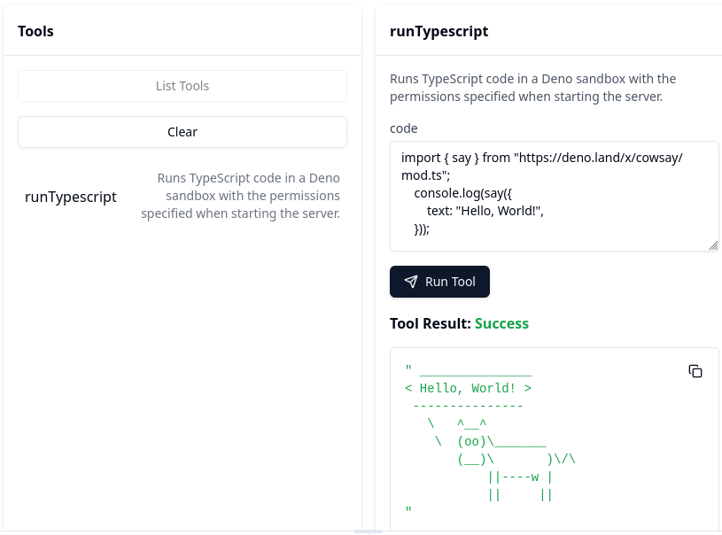

# Deno Sandbox MCP Server

An MCP server that allows you to run TypeScript and JavaScript code securely on your local machine using the Deno® sandbox. This server provides a controlled environment for executing code with explicit permission controls.

> **Note:** This project is not affiliated with Deno Land LLC in any way. I'm just a fan of the Deno® runtime. "Deno" is a registered trademark of Deno Land LLC.



## Features

- Restricted runtime environment for TypeScript/JavaScript code
- Granular permission control via command-line flags
- Clear error messages for permission issues
- Resource that lists available permissions

## Non Features

I would like to keep this codebase as simple as possible so that someone can read it quickly and tell that it is not going to do anything dodgy to their machine.  I therefore am going to try and avoid the temptation to add features which make the code harder to read and leave it to others to build the cleverer mcp servers.

## Usage with Claude Desktop

This MCP should work with a range of MCP clients.

To use this MCP server with Claude Desktop, add it to your `claude_desktop_config.json` in:

* macOS: `~/Library/Application Support/Claude/claude_desktop_config.json`
* Windows: `%APPDATA%\Claude\claude_desktop_config.json`


*If you have Deno installed*
```json
{
  "mcpServers": {
    "denoSandbox": {
      "command": "deno",
      "args": [
        "run",
        "npm:mcp-deno-sandbox",
        "--allow-net=icanhazip.com"
      ]
    }
  }
}
```

*If you have Nodejs installed*
```json
{
  "mcpServers": {
    "denoSandbox": {
      "command": "npx",
      "args": [
        "mcp-deno-sandbox",
        "--allow-net=icanhazip.com"
      ]
    }
  }
}
```

### Permission Examples

You need to set the permissions at runtime; if you change them you need to restart the server.

The permissions are the same as the [Deno® permissions](https://docs.deno.com/runtime/fundamentals/security/) and are just passed through.

*Examples*

1. **Network Access**
   - Permissive: `--allow-net`
     - Allows all network access
   - Restricted: `--allow-net=api.github.com,example.com`
     - Allows network access only to specific domains

2. **File System**
   - Permissive: `--allow-read --allow-write`
     - Full file system access
     - Tradeoff: Rogue LLMs can access your dotfiles and anything else you can (including the file it can edit to give itself more permissions)
   - Restricted: `--allow-read=/tmp --allow-write=/tmp`
     - Limited to specific directories
     - Good for processing isolated files

For a complete list of permissions and detailed documentation, see [Deno® Security](https://docs.deno.com/runtime/fundamentals/security/).

## Security Considerations

This server runs code using the permissions specified when starting the server. These permissions are passed through to the Deno® runtime.

Remember that any code executed has access to the permissions you've provided, so be careful about what permissions you enable.  

The sandbox is completely undermined by:
* giving blanket FFI or execution permissions
* allowing write access to the file which manages the server permissions (e.g. `claude_desktop_config.json`)

You should also think carefully about read permissions to sensitive `dotfiles` you have (e.g. with credentials for AWS, NPM, OpenAI); especially if you have granted network access.

Remember malicious people can use prompt injection to trick your prefered language model into running bad things on your computer.  Maybe they can hide some invisible text in a PDF which you cannot read or in the middle of a long document you ask it to summarise.

Deno® has some [additional suggestions](https://docs.deno.com/runtime/fundamentals/security/#executing-untrusted-code) if you would like even more isolation for untrusted code.

## Development

```bash
# Clone the repository
git clone https://github.com/bewt85/mcp-deno-sandbox.git
cd mcp-deno-sandbox

# Install dependencies
npm install
```

Check the code formatting and types:

```bash
npm run checks
```

Fix some issues automatically:

```bash
npm run fix
```

Test with the MCP Inspector:

```bash
npx @modelcontextprotocol/inspector ./node_modules/.bin/ts-node src/index.ts
```

Try these examples in the inspector:

1. Basic arithmetic (works without permissions):
   ```typescript
   console.log(1 + 2);
   ```

2. Network access (requires `--allow-net`):
   ```typescript
   fetch('https://icanhazip.com').then(response => response.text()).then(ip => console.log(`Your IP is: ${ip.trim()}`));
   ```

3. File system access (requires `--allow-read`):
   ```typescript
   const text = Deno.readTextFileSync('/path/to/file.txt');
   console.log(text);
   ```

## Contributing

I don't that a lot of spare time so I will not be able to engage with most feature requests / contributions.  It is probably better to fork the repository if you would like to add something. Apologies. 

## Releases

When you want to do a release:
* update the version in `package.json` to X.Y.Z
* merge your changes
* make a release in GitHub vX.Y.Z
* wait for it to be automatically deployed to NPM


## License

MIT
